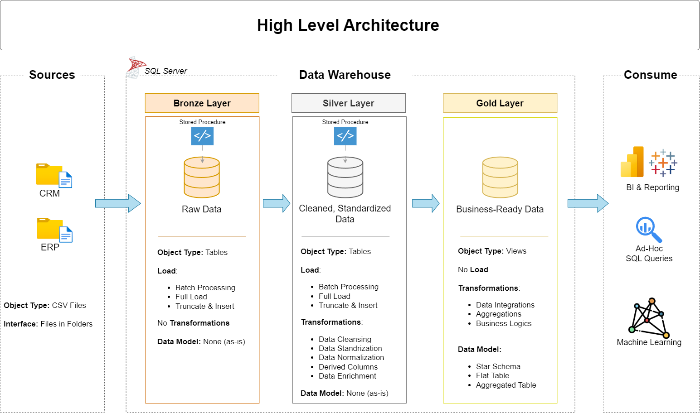

Based on the provided `README.md` file, I will update the content with detailed context.

# Data Warehouse and Analytics Project

Welcome to the **Data Warehouse and Analytics Project** repository! 
This project demonstrates a comprehensive data warehousing and analytics solution, from building a data warehouse to generating actionable insights. Designed as a portfolio project, it highlights industry best practices in data engineering and analytics.

---
## Data Architecture

The data architecture for this project follows Medallion Architecture **Bronze**, **Silver**, and **Gold** layers:


1. **Bronze Layer**: Stores raw data as-is from the source systems. Data is ingested from CSV Files into SQL Server Database. The `ddl_bronze.sql` script creates the tables for the Bronze layer, and the `load_bronze` stored procedure loads the data from the external sources into these tables.
2. **Silver Layer**: This layer includes data cleansing, standardization, and normalization processes to prepare data for analysis. The `ddl_silver.sql` script creates the tables for the Silver layer, and the `load_silver` stored procedure transforms and loads the data from the Bronze layer into these tables.
3. **Gold Layer**: Houses business-ready data modeled into a star schema required for reporting and analytics. The `ddl_gold.sql` script creates the views for the Gold layer, which combine data from the Silver layer to produce a clean and business-ready dataset.

---
## Project Overview

This project involves:

1. **Data Architecture**: Designing a Modern Data Warehouse Using Medallion Architecture **Bronze**, **Silver**, and **Gold** layers.
2. **ETL Pipelines**: Extracting, transforming, and loading data from source systems into the warehouse. The `load_bronze` and `load_silver` stored procedures are used to load data into the Bronze and Silver layers, respectively.
3. **Data Modeling**: Developing fact and dimension tables optimized for analytical queries. The `ddl_gold.sql` script creates the views for the Gold layer, which model the data into a star schema.
4. **Analytics & Reporting**: Creating SQL-based reports and dashboards for actionable insights. The `gold.dim_customers`, `gold.dim_products`, and `gold.fact_sales` views provide a foundation for analytics and reporting.

---
## Project Requirements

### Building the Data Warehouse (Data Engineering)

#### Objective
Develop a modern data warehouse using SQL Server to consolidate sales data, enabling analytical reporting and informed decision-making.

#### Specifications
- **Data Sources**: Import data from two source systems (ERP and CRM) provided as CSV files.
- **Data Quality**: Cleanse and resolve data quality issues prior to analysis. The `load_silver` stored procedure performs data cleansing and standardization.
- **Integration**: Combine both sources into a single, user-friendly data model designed for analytical queries. The `ddl_gold.sql` script creates the views for the Gold layer, which integrate data from the Silver layer.
- **Scope**: Focus on the latest dataset only; historization of data is not required.
- **Documentation**: Provide clear documentation of the data model to support both business stakeholders and analytics teams.

### BI: Analytics & Reporting (Data Analysis)

#### Objective
Develop SQL-based analytics to deliver detailed insights into:
- **Customer Behavior**
- **Product Performance**
- **Sales Trends**

These insights empower stakeholders with key business metrics, enabling strategic decision-making. The `gold.dim_customers`, `gold.dim_products`, and `gold.fact_sales` views provide a foundation for analytics and reporting.

## Repository Structure
```
data-warehouse-project/
│
├── datasets/                           # Raw datasets used for the project (ERP and CRM data)
│
├── scripts/                            # SQL scripts for ETL and transformations
│   ├── bronze/                         # Scripts for extracting and loading raw data
│   │   ├── ddl_bronze.sql              # Create tables for Bronze layer
│   │   ├── load_bronze.sql             # Load data into Bronze layer
│   ├── silver/                         # Scripts for cleaning and transforming data
│   │   ├── ddl_silver.sql              # Create tables for Silver layer
│   │   ├── load_silver.sql             # Load data into Silver layer
│   ├── gold/                           # Scripts for creating analytical models
│   │   ├── ddl_gold.sql                # Create views for Gold layer
│
├── tests/                              # Test scripts and quality files
│   ├── quality_checks_gold.sql         # Quality checks for Gold layer
│   ├── quality_checks_silver.sql       # Quality checks for Silver layer
│
├── README.md                           # Project overview and instructions
├── .gitignore                          # Files and directories to be ignored by Git